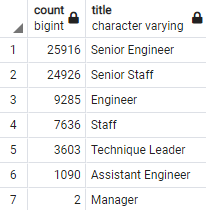

# SQL Challenge
## Overview
The goal of this task was to locate all retiring employees by title across all departments and compile them into one convenient file. After finishing determining how many employees in each department are retiring, employees eligible for the company mentorship program were also compiled. The analysis of these is to assist and inform management in how to proceed as more and more employees retire, and need to be replaced.

## Results
- Most employees are retiring employees have the "Senior Engineer" or "Senior Staff" title.  Together, they account for 70% of retiring employees, with the combined count numbering just over 50,000.

- Of the remaining 30% retiring, the bulk are made up of basic engineers and staff. Only two managers are retiring and less than 4,000 technique leaders are retiring. 

The table has been provided below to illustrate the disparity between the first point and the second.

- There are 1,549 employees eligible for the company mentorship program.

- The mentorship program alone will not be enough is act as counterbalance to the imminent employee loss through retirement.

## Summary
It is difficult to determine just how many roles need to be filled and at what rate, because while we have the retirement-ready employees across all departments and their titles, we do not have their retirement dates. We do not know if they intend to retire this year, next year, five years from now and so on. This is something that needs to be accounted for and assessed sooner rather than later, because this information will give us a more efficient starting point when planning around the "silver tsunami." We know senior staff or senior engineers will experience the most dramatic loss, but these losses will not necessarily occur simultaneously, and may not impact the company in the exact same way.

With the amount of employees currently eligible for the mentorship program, there are more than enough retirement-ready employees to take them on.

A table that would be immensely useful would be a count of the titles of those eligible for the mentorship program. Senior engineer and senior staff positions should be prioritized, so we need to know which employees will actually be mentoring under those titles.

On that note, we also need to know the interest level of those eligible for the program, and what, if any, incentives might entice them to rise the opportunity.

Another table that might prove useful with the information we currently have is a table listing the retirement-ready by birthdate. While age is not necessarily an indicator of who is going to retire soon, it is a good place to start when the number retiring is so high.
